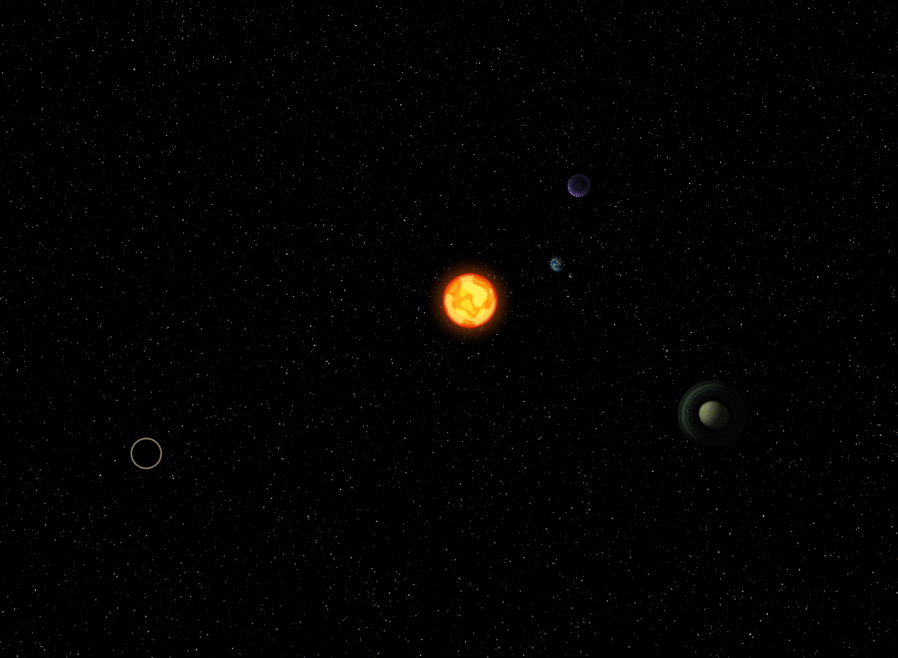
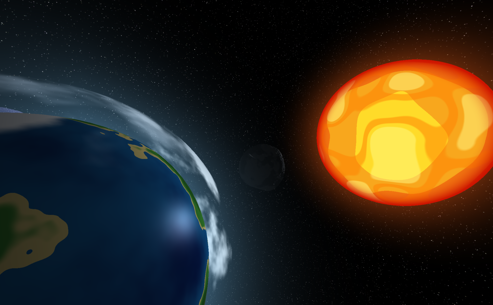
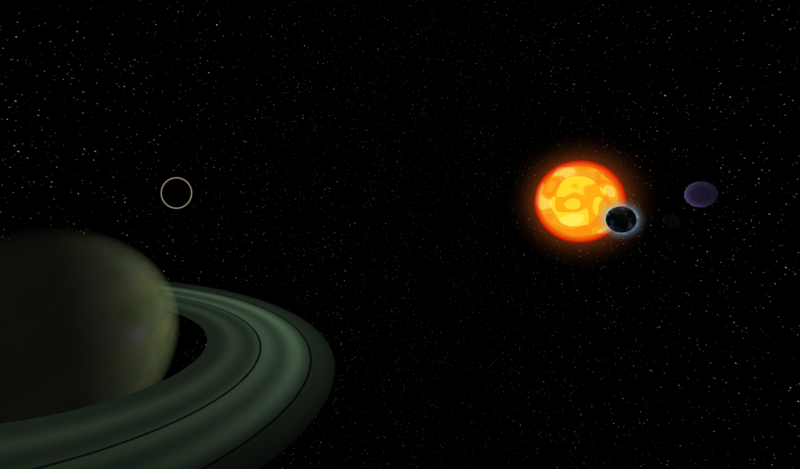
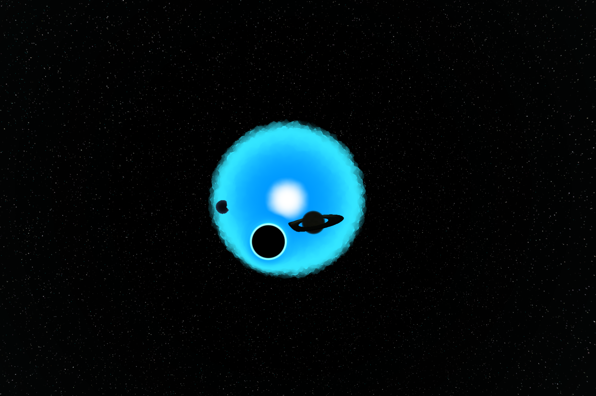
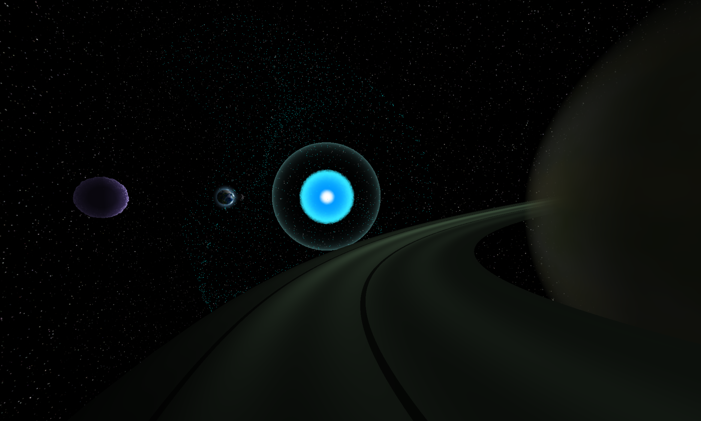

# Projet POGL

Projet POGL is a real-time 3D space scene built with C++ and OpenGL. It features
animated celestial bodies, procedural GLSL shaders, a skybox, a supernova, and a
black hole with gravitational lensing.

This project was created for the POGL (OpenGL Programming) course as part of
the IMAGE major at EPITA.

## Screenshots

<p align="center">
  
  <br>
  <em>Overview of the full planetary system</em>
</p>

<table>
  <tr>
    <td align="center">
      
      <br>
      <em>Earth, Moon, and Sun alignment</em>
    </td>
    <td align="center">
      
      <br>
      <em>Wide view across the system</em>
    </td>
  </tr>
  <tr>
    <td align="center">
      
      <br>
      <em>A new start</em>
    </td>
    <td align="center">
      
      <br>
      <em>The end</em>
    </td>
  </tr>
</table>

## Requirements

- CMake 3.20 or later
- A C++17-compatible compiler
- Linux with an OpenGL 4.3-compatible GPU and driver
- GLEW
- FreeGLUT
- GLM

On Ubuntu or Debian:

```bash
sudo apt update
sudo apt install build-essential cmake libglew-dev freeglut3-dev libglm-dev
```

## Build and run

From the project root:

```bash
cmake -S . -B build -DCMAKE_BUILD_TYPE=Release
cmake --build build --parallel
./build/ProjetPOGL
```

Launch the application from the project root so it can find the `assets` and
`shaders` directories.

## Controls

- `W`, `A`, `S`, `D`: move
- `Q`, `E`: move vertically
- `I`, `J`, `K`, `L`: rotate the camera
- `C`, `X`: adjust movement speed
- `M`, `N`: move forward or backward in time
- `1`–`4`: attach the camera to a celestial body; `0` detaches it
- `P`: trigger the supernova
- `F`: switch to fullscreen
- `Esc`: quit
